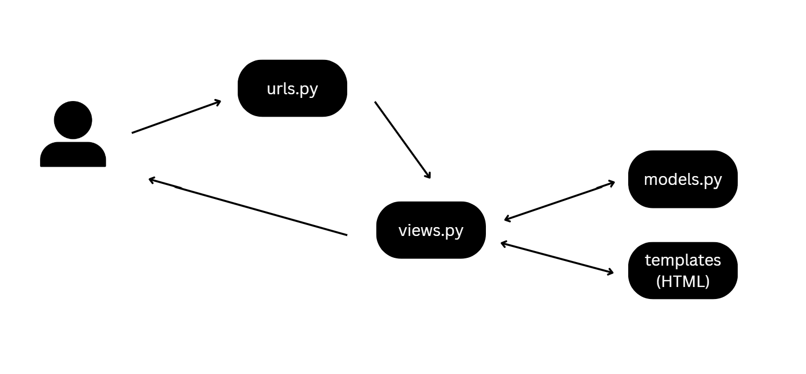
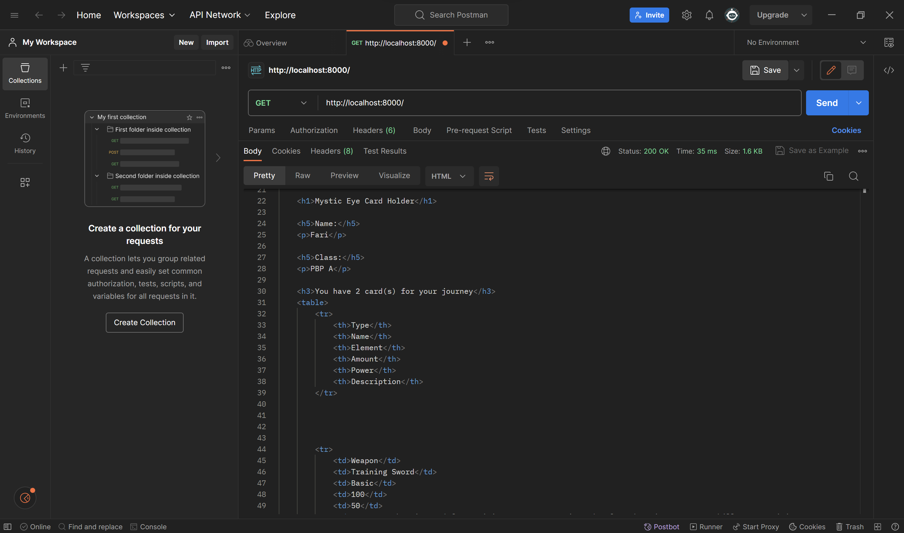
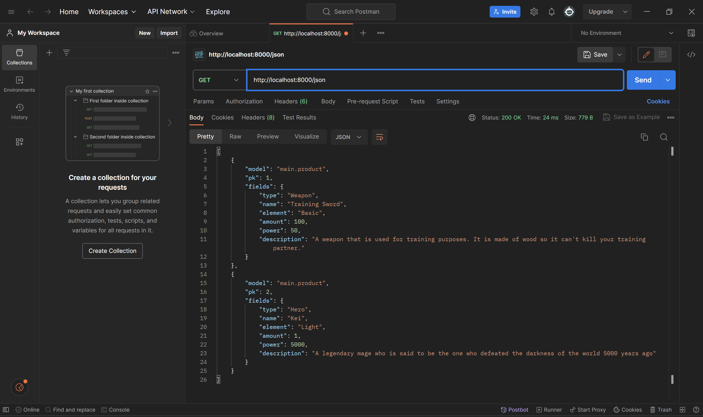
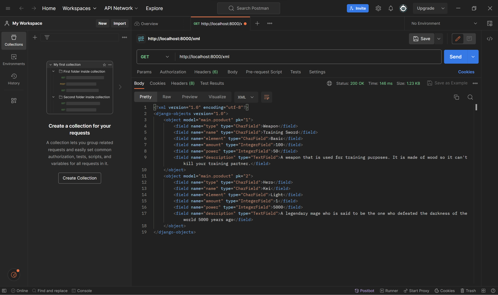
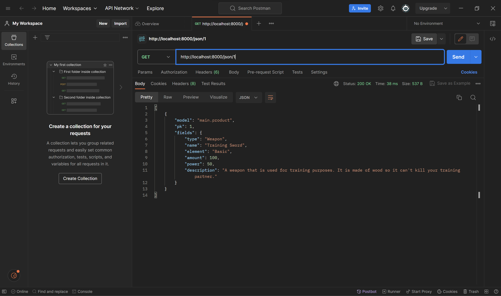
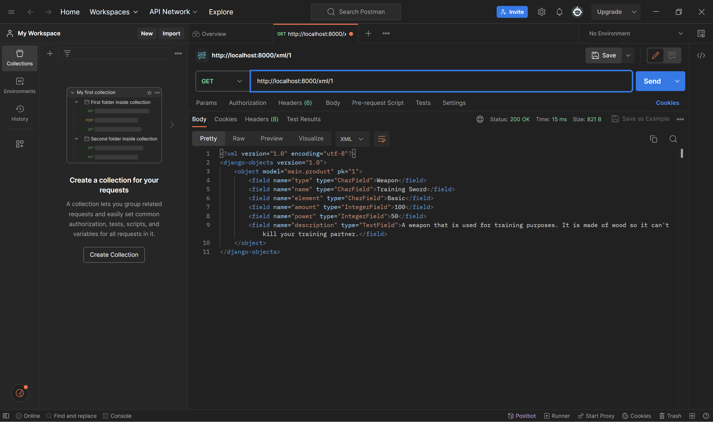
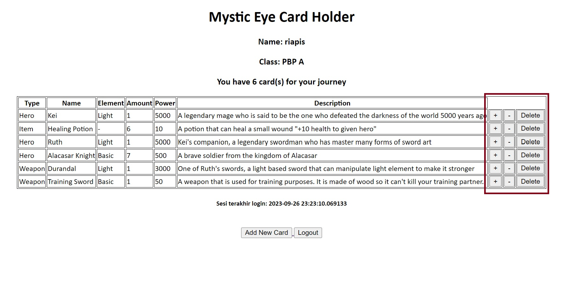
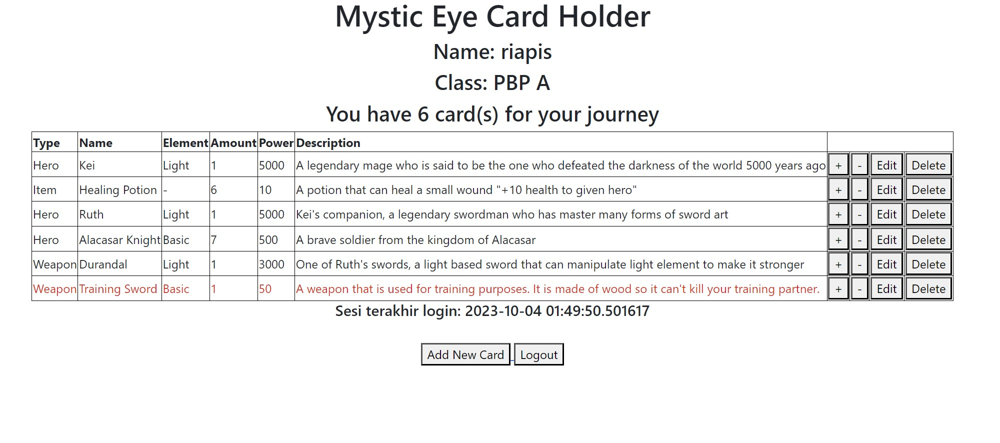

# Mystic Eyes
Trading Card Game dengan Tema Fantasi.
https://mystic-eyes.adaptable.app/
#

# Tugas 2
## Pembuatan aplikasi
### A. Membuat sebuah proyek Django baru
1. Buat direktori bernama `mystic_eyes`, lalu ke command prompt melalui direktori tersebut dan jalankan `python -m venv env` untuk membuat *virtual environment*
2. Jalankan `env\Scripts\activate.bat` untuk mengaktifkan *virtual environment*
3. Buat `requirements.txt` pada direktori dan isi dengan beberapa *dependencies*
   
   ```
   django
   gunicorn
   whitenoise
   psycopg2-binary
   requests
   urllib3
   ```
    Untuk mengaktifkan *dependencies*, jalankan `pip install -r requirements.txt`
4.  Buat proyek django dengan menjalankan `django-admin startproject mystic_eyes .`

### B. Membuat aplikasi dengan nama `main` pada proyek tersebut
1. Jalankan `python manage.py startapp main` untuk membuat aplikasi (akan membuat direktori baru bernama `main`)
2. Buka `mystic_eyes` -> `setting.py`, temukan `INSTALLED_APPS` dan tambahkan 'main'

   ```
   INSTALLED_APPS = [
    ...,
    'main',
    ...
   ]
   ```

### C. Melakukan routing pada proyek agar dapat menjalankan aplikasi `main`
1. Buka `mystic_eyes` -> `urls.py`
2. Tambahkan rute URL untuk mengarahkan ke tampilan `main` di dalam variabel `urlpatterns`
   
   ```
   urlpatterns = [
    ...
    path('main/', include('main.urls')),
    ...
    ]
   ```

### D. Membuat model pada aplikasi `main` dengan nama `Item` dan memiliki atribut wajib
1. Buka `main` -> `models.py` dan isi dengan

   ```
   from django.db import models

   # Create your models here.
   class Product(models.Model):
       type = models.CharField(max_length=255)
       name = models.CharField(max_length=255)
       element = models.CharField(max_length=255)
       amount = models.IntegerField()
       power = models.IntegerField()
       description = models.TextField()
   ```
2. Jalankan perintah `python manage.py makemigrations` untuk membuat migrasi model
3. Jalankan perintah `python manage.py migrate` untuk menerapkan migrasi ke dalam basis data lokal

### E. Membuat sebuah fungsi pada `views.py` untuk dikembalikan ke dalam sebuah template HTML
1. Buka `main` -> `views.py` dan isi dengan
   
   ```
   from django.shortcuts import render

    # Create your views here.
    def show_main(request):
        context = {
            'nama': 'Fari',
            'kelas': 'PBP A'
        }
    
        return render(request, "main.html", context)
   ```
2. Buka direktori `main` dan buat direktori baru bernama `tempalates`
3. Dalam direktori `templates` buat file bernama `main.html` dan isi dengan
   
   ```
   <h1>Mystic Eyes Card Holder</h1>

   <h5>Name: </h5>
   <p>{{ nama }}</p>
   <h5>Class: </h5>
   <p>{{ kelas }}</p>
   ```

### F. Membuat sebuah routing pada `urls.py` aplikasi main untuk memetakan fungsi yang telah dibuat pada `views.py`
1. Buka direktori `main` dan buat direktori baru bernama `urls.py`
2. Isi `urls.py` dengan
   
   ```
   from django.urls import path
   from main.views import show_main
    
   app_name = 'main'
    
   urlpatterns = [
       path('', show_main, name='show_main'),
   ]
   ```

### G. Melakukan deployment ke Adaptable terhadap aplikasi yang sudah dibuat
1. *Log in* ke Adaptable dengan Github
2. Pilih *new app* -> *connect an existing repository* -> pilih repository `mystic_eyes`
3. Pilih *Python App* Template sebagai template deployment
4. Pilih *PostgreSQL* sebagai tipe basis data yang akan digunakan
5. Pada bagian Start Command masukkan perintah `python manage.py migrate && gunicorn rey_inventory.wsgi`

## Bagan request client ke web aplikasi berbasis Django

Saat klien mengakses situs berbasi django, browser akan mengirimkan HHTP request ke `urls.py` untuk di handle. `urls.py` akan menghubungkan URL dengan view yang sesuai dengan `views.py`. `views.py` akan mengambil data dari `models.py` dan mengirimkannya ke `templates` untuk merendel tampilan yang nantinya akn dikembalikan ke klien untuk menjadi userinterface.

## Alasan menggunakan *virtual environment* dan apa yang terjadi jika tidak menggunakan *virtual environment* 
*Virtual environment* berfungsi untuk mengelola dependensi dan paket Python untuk proyek Anda secara terpisah dari sistem Python global. Hal ini dapat menghindari konflik jika kita bekerja pada dua proyek dengan versi berbeda, tetapi dari paket yang sama.

Jika kita tidak menggunakan *virtual environment*, sebenarnya kita tetap bisa membuat aplikasi web berbasis django. Namun risiko terjadinya konflik akan sangat besar.

## MVC, MVT, MVVM
1. MVC (Model View Controller)
   * Model: mengatur cara data disimpan, diambil, dan diperbarui
   * View: menggambarkan tampilan dan berinteraksi dengan pengguna
   * Controller: menerima input dari pengguna dan mengoordinasikan tindakan yang diperlukan oleh Model dan View (penghubung antara Model dan View)
2. MVT (Model View Template)
   * Model: mengatur cara data disimpan, diambil, dan diperbarui
   * View: menggambarkan tampilan dan berinteraksi dengan pengguna
   * Template: komponen tambahan yang digunakan untuk merender tampilan
3. MVVM (Model View ViewModel)
   * Model:  mengatur cara data disimpan, diambil, dan diperbarui
   * View: menggambarkan tampilan dan berinteraksi dengan pengguna
   * ViewModel: mengubah data dari Model menjadi format yang dapat digunakan oleh View, dan juga menerima tindakan pengguna dari View dan meneruskannya ke Model

Perbedaan  MVC, MVT, MVVM:
Perbedaan utama ketiganya adalah dalam cara komponen-komponen tersebut berinteraksi, MVC menggunakan Controller untuk mengoordinasikan Model dan View, MVT menggunakan Template untuk mengatur presentasi tampilan, dan MVVM menggunakan ViewModel sebagai perantara View dan Model.

#
# Tugas 3
## `POST` vs `GET` dalam django
<table>
  <tr>
    <th>POST</th>
    <th>GET</th>
  </tr>
  <tr>
    <td>Data/value tidak terlihat di URL</td>
    <td>Data/value terlihat di URL</td>
  </tr>
  <tr>
    <td>Tidak ada batasan ukuran untuk data yang dapat dikirimkan</td>
    <td>Terdapat batasan ukuran URL yang dapat ditangani oleh server</td>
  </tr>
  <tr>
  <td>Untuk request yang dapat mengubah data di server</td>
  <td>Untuk request yang tidak mengubah data di server</td>
  </tr>
</table>

## Perbedaan XML, JSON, dan HTML dalam pengiriman data
1. XML
   * Dapat mendefinisikan struktur data secara bebas, sehingga XML lebih kompleks dibanding JSON dan HTML
   * Digunakan secara luas untuk pertukaran data antara sistem yang berbeda dan konfigurasi file
2. JSON
   * Struktur data lebih sederhana dan strukturnya terdiri dari pasangan nama-nilai
   * Umumnya digunakan untuk pertukaran data antar aplikasi web
3. HTML
   * Digunakan untuk membuat tampilan halaman web dan mengorganisir kontennya

## Mengapa JSON sering digunakan dalam pertukaran data antara aplikasi web modern?
Karena JSON memiliki banyak keunggulan yang diantaranya:
1. JSON memiliki format yang sangat ringkas dan ringan
2. Menggunakan sintaks yang mudah dibaca dan ditulis oleh manusia
3. Hampir semua bahasa pemrograman modern memiliki dukungan untuk mengurai dan membuat JSON

## Pengimplementasian *checklist*
### A. Membuat input `form` untuk menambahkan objek model pada app sebelumnya
1. Membuat `forms.py` di direktori `main` dan isi dengan
   
   ```
   from django.forms import ModelForm
   from main.models import Product

   class ProductForm(ModelForm):
    class Meta:
        model = Product
        fields = ["type", "name", "element", "amount", "power", "description"]
   ```
2. Buka folder `main` -> `views.py` dan tambahkan
   beberapa import

   ```
   from django.http import HttpResponseRedirect
   from main.forms import ProductForm
   from django.urls import reverse
   ```
   dan fungsi `add_card`

   ```
   def add_card(request):
       form = ProductForm(request.POST or None)
   
       if form.is_valid() and request.method == "POST":
           form.save()
           return HttpResponseRedirect(reverse('main:show_main'))
   
       context = {'form': form}
       return render(request, "add_card.html", context)
   ```
3. Mengubah fungsi `show_main` menjadi

   ```
   def show_main(request):
       products = Product.objects.all()
   
       context = {
           'name': 'Fari', # Nama kamu
           'class': 'PBP A', # Kelas PBP kamu
           'products': products
       }
   
       return render(request, "main.html", context)
   ```
4. Buka `main` -> `urls.py`
   import fungsi `add_card`
   
   ```
   from main.views import show_main, add_card
   ```
   dan tambahkan *path url* ke dalam `urlpatterns`

   ```
   urlpatterns = [
       ...
       path('add-card', add_card, name='add_card'),
       ...
   ] 
   ```
5. Buka `main` -> `template` dan buat file baru bernama `add_card.html` dengan kode berikut

   ```
    

   
   <h1>Add New Card</h1>
   
   <form method="POST">
       
       <table>
           {{ form.as_table }}
           <tr>
               <td></td>
               <td>
                   <input type="submit" value="Add Card"/>
               </td>
           </tr>
       </table>
   </form>
   
   
   ```
6. Pada direktori yang sama buka `main.html` dan ubah kode menjadi seperti berikut

   ```
   

   
   
   <style>
       table, th, td {
         border:1px solid black;
       }
   </style>
   
       <h1>Mystic Eye Card Holder</h1>
   
       <h5>Name:</h5>
       <p>{{name}}</p>
   
       <h5>Class:</h5>
       <p>{{class}}</p>
   
       <h3>You have {{ products|length }} card(s) for your journey</h3>
   <table>
       <tr>
           <th>Type</th>
           <th>Name</th>
           <th>Element</th>
           <th>Amount</th>
           <th>Power</th>
           <th>Description</th>
       </tr>
   
        Berikut cara memperlihatkan data produk di bawah baris ini 
   
       
           <tr>
               <td>{{product.type}}</td>
               <td>{{product.name}}</td>
               <td>{{product.element}}</td>
               <td>{{product.amount}}</td>
               <td>{{product.power}}</td>
               <td>{{product.description}}</td>
           </tr>
       
   </table>
   
   <br />
   
   <a href="">
       <button>
           Add New Card
       </button>
   </a>
   
   
   ```

### B. Tambahkan 5 fungsi `views` untuk melihat objek yang sudah ditambahkan dalam format HTML, XML, JSON, XML *by ID*, dan JSON *by ID*
1. Buka `main` -> `views.py` dan tambahkan beberapa import

   ```
   from django.http import HttpResponse
   from django.core import serializers
   ```
2. Menambahkan fungsi `show_xml`, `show_json`, `show_xml_by_id`, `show_json_by_id`

   ```
   def show_xml(request):
       data = Product.objects.all()
       return HttpResponse(serializers.serialize("xml", data), content_type="application/xml")

   def show_json(request):
       data = Product.objects.all()
       return HttpResponse(serializers.serialize("json", data), content_type="application/json")
   
   def show_xml_by_id(request, id):
       data = Product.objects.filter(pk=id)
       return HttpResponse(serializers.serialize("xml", data), content_type="application/xml")
   
   def show_json_by_id(request, id):
       data = Product.objects.filter(pk=id)
       return HttpResponse(serializers.serialize("json", data), content_type="application/json")
   ```

### C. Membuat routing URL untuk masing - masing `views` yang telah ditambahkan pada poin 2
1. Buka `main` -> `urls.py` dan tambahkan ke 4 fungsi yang telah dibuat

   ```
   from main.views import show_main, add_card, show_xml, show_json, show_xml_by_id, show_json_by_id 
   ```
2. tambahkan masing - masing *path url* ke dalam `urlpatterns`

   ```
   urlpatterns = [
    ...
    path('xml/', show_xml, name='show_xml'), # XML
    path('json/', show_json, name='show_json'), # JSON
    path('xml/<int:id>/', show_xml_by_id, name='show_xml_by_id'), # XML by ID
    path('json/<int:id>/', show_json_by_id, name='show_json_by_id'), # JSON by ID
    ...
   ]
   ```
   
## *screenshot* dari hasil akses URL
1. HTML
   
2. JSON
   
3. XML
   
4. JSON *by ID*
   
5. XML *by ID*
    

## Bonus
Menambahkan pesan "Kamu menyimpan X item pada aplikasi ini" dengan menggunakan kode

```
<h3>You have {{ products|length }} card(s) for your journey</h3>
```
#

# Tugas 4
## Apa itu Django `UserCreationForm`, dan jelaskan apa kelebihan dan kekurangannya?
`UserCreationForm` adalah *built-in form* yang disediakan oleh django untuk pembuatan *user* baru dalam web
<table>
  <tr>
    <th>Kelebihan</th>
    <th>Kekurangan</th>
  </tr>
  <tr>
    <td>Mudah digunakan</td>
    <td>Kurangnya fitur tambahan</td>
  </tr>
  <tr>
    <td>Sudah terdapat validasi bawaan</td>
    <td>Tidak cocok untuk keperluan validasi yang rumit</td>
  </tr>
</table>

## Autentikasi VS Otorisasi dalam django
<table>
  <tr>
    <td>Autentikasi</td>
    <td>Proses validasi identitas <i>user</i></td>
  </tr>
  <tr>
    <td>Otorisasi</td>
    <td>Proses pemberian hak akses kepada <i>user</i></td>
  </tr>
</table>

## Cookies dalam konteks aplikasi web
Cookies adalah *file text* dengan sejumlah data yang kecil yang disimpan di sisi klien dan digunakan untuk menyimpan informasi tertentu terkait dengan sesi pengguna atau preferensi

Django menggunakan cookies untuk mengelola data sesi pengguna dengan bantuan komponen yang disebut "Django Session Framework". Hal ini memungkinkan pengembang Django untuk menyimpan dan mengambil data sesi pengguna di antara permintaan HTTP yang berbeda

## Apakah cookies aman?
Secara umum, penggunaan cookies aman karena data tersimpan di sisi klien atau *user*. Namun, walaupun bisa dikatakan aman risiko pasti masih ada, salah satunya adalah *cookie theft*. Jika cookie tidak disimpan dengan aman, maka seseorang bisa saja mendapatkan cookie kita yang mungkin akan berisi beberapa informasi seperti *username* dan *password*

## Pengimplementasian *checklist*
### A. Mengimplementasikan fungsi registrasi, login, dan logout untuk memungkinkan pengguna untuk mengakses aplikasi sebelumnya dengan lancar
#### Registrasi
1. Buka `main` -> `views.py` dan buat fungsi `registrasi` dengan isi

   ```
   def register(request):
    form = UserCreationForm()

    if request.method == "POST":
        form = UserCreationForm(request.POST)
        if form.is_valid():
            form.save()
            messages.success(request, 'Your account has been successfully created!')
            return redirect('main:login')
    context = {'form':form}
    return render(request, 'register.html', context)
   ```
2. Buka direktori `main` -> `templates` dan buat file `registrasi.html` dengan isi

   ```
   

   
       <title>Register</title>
   
   
     
   
   <div class = "login">
    
    <h1>Register</h1>  

        <form method="POST" >  
              
            <table>  
                {{ form.as_table }}  
                <tr>  
                    <td></td>
                    <td><input type="submit" name="submit" value="Daftar"/></td>  
                </tr>  
            </table>  
        </form>

      
        <ul>   
              
                <li>{{ message }}</li>  
                  
        </ul>   
    

   </div>  
   
   
   ```
3. Buka `main` -> `urls.py` dan tambahkan

   ```
   from main.views import register
   ```

   ```
   urlpatterns = [
      ...
      path('register/', register, name='register'),
      ...
   ]
   ```
#### Login
1. Buka `main` -> `views.py` dan buat fungsi `login_user` dengan isi

   ```
   def login_user(request):
    if request.method == 'POST':
        username = request.POST.get('username')
        password = request.POST.get('password')
        user = authenticate(request, username=username, password=password)
        if user is not None:
            login(request, user)
            return redirect('main:show_main')
        else:
            messages.info(request, 'Sorry, incorrect username or password. Please try again.')
    context = {}
    return render(request, 'login.html', context)
   ```
2. Buka direktori `main` -> `templates` dan buat file `login.html` dengan isi

   ```
   

   
       <title>Login</title>
   
   
   
   
   <div class = "login">

    <h1>Login</h1>

    <form method="POST" action="">
        
        <table>
            <tr>
                <td>Username: </td>
                <td><input type="text" name="username" placeholder="Username" class="form-control"></td>
            </tr>
                    
            <tr>
                <td>Password: </td>
                <td><input type="password" name="password" placeholder="Password" class="form-control"></td>
            </tr>

            <tr>
                <td></td>
                <td><input class="btn login_btn" type="submit" value="Login"></td>
            </tr>
        </table>
    </form>

    
        <ul>
            
                <li>{{ message }}</li>
            
        </ul>
         
        
    Don't have an account yet? <a href="">Register Now</a>

   </div>
   
   
   ```
3. Buka `main` -> `urls.py` dan tambahkan

   ```
   from main.views import login_user
   ```

   ```
   urlpatterns = [
      ...
      path('login/', login_user, name='login'),
      ...
   ]
   ```
#### Logout
1. Buka `main` -> `views.py` dan buat fungsi `logout_user` dengan isi

   ```
   def logout_user(request):
    logout(request)
    return redirect('main:login')
   ```
2. Buka direktori `main` -> `templates` -> `main.html` dan tambahkan
   ```
   ...
   <a href="">
       <button>
           Logout
       </button>
   </a>
   ...
   ```
3. Buka `main` -> `urls.py` dan tambahkan

   ```
   from main.views import logout_user
   ```

   ```
   urlpatterns = [
      ...
      path('logout/', logout_user, name='logout'),
      ...
   ]
   ```

### B. Membuat dua akun pengguna dengan masing-masing tiga dummy data menggunakan model yang telah dibuat pada aplikasi sebelumnya untuk setiap akun di lokal
1. Jalankan server dengan command `python manage.py runserver`
2. Buka tautan web `http://localhost:8000/`
3. Jika belum punya akun, maka buat akun dengan mengklik *Register Now*. Setelah itu, *login* dengan akun yang telah dibuat
4. Klik *button Add New Card* untuk menambah item
5. Ulangi langkah - langkah diatas untuk akun atau menambah *item* lainnya

### C. Menghubungkan `model` Item dengan `User`
1. Buka `main` -> `models.py` dan tambahkan

   ```
   ...
   from django.contrib.auth.models import User
   ...
   ```
   pada `product` tambahkan juga

   ```
   class Product(models.Model):
      user = models.ForeignKey(User, on_delete=models.CASCADE)
      ...
   ```
2. Buka `main` -> `views.py`, pada fungsi `create_product` ubah kode menjadi

   ```
   def create_product(request):
    form = ProductForm(request.POST or None)
   
    if form.is_valid() and request.method == "POST":
        product = form.save(commit=False)
        product.user = request.user
        product.save()
        return HttpResponseRedirect(reverse('main:show_main'))
    ...
   ```
   dan fungsi `show_main` menjadi

   ```
   def show_main(request):
       products = Product.objects.filter(user=request.user)
   
       context = {
           'name': request.user.username,
       ...
   ...
   ```
3. Lakukan migrasi untuk mendeteksi perubahan terhadap model

### D. Menampilkan detail informasi pengguna yang sedang *logged in* seperti *username* dan menerapkan `cookies` seperti `last login` pada halaman utama aplikasi
1. Buka `main` -> `views.py` dan tambahkan

   ```
   import datetime
   from django.http import HttpResponseRedirect
   from django.urls import reverse
   ```
2. Pada fungsi `login_user` tambahkan kode

   ```
   ...
   if user is not None:
       login(request, user)
       response = HttpResponseRedirect(reverse("main:show_main")) 
       response.set_cookie('last_login', str(datetime.datetime.now()))
       return response
   ...
   ```
3. Pada fungsi `show_main` tambahkan kode

   ```
   context = {
    'name': request.user.username,
    'class': 'PBP A',
    'products': products,
    'last_login': request.COOKIES['last_login'],
   }
   ```
4. Ubah fungsi `logout_user` menjadi

   ```
   def logout_user(request):
       logout(request)
       response = HttpResponseRedirect(reverse('main:login'))
       response.delete_cookie('last_login')
       return response
   ```
5. Buka `main` -> `templates` -> `main.html` dan tambahkan kode

   ```
   ...
   <h5>Sesi terakhir login: {{ last_login }}</h5>
   ...
   ```

## Bonus


#
# Tugas 5
## Manfaat tiap *element selector* dan waktu penggunannya
<table>
  <tr>
    <th>Jenis</th>
    <th>Manfaat</th>
    <th>Waktu Penggunaan</th>
  </tr>
  <tr>
    <td>Type Selector</td>
    <td>ID Selector</td>
    <td>Class Selector</td>
    <td>Universal Selector</td>
  </tr>
  <tr>
    <td>Ketika ingin mengubah gaya semua elemen dengan jenis yang sama di seluruh situs web</td>
    <td>Ketika Anda ingin memberi gaya khusus ke satu elemen tertentu</td>
    <td>Ketika Anda ingin mengubah gaya beberapa elemen yang memiliki karakteristik yang sama, seperti tombol</td>
    <td>ketika Anda ingin mengatur gaya default untuk elemen atau menghapus gaya default yang diberikan oleh browser</td>
  </tr>
</table>

## HTML5 Tag
1. <header>: Digunakan untuk menunjukkan bagian atas atau kepala dari suatu elemen atau sektor dalam halaman web
2. <nav>: Mendefinisikan bagian navigasi dalam dokumen
3. <section>: Mengelompokkan konten terkait secara tematis dalam sebuah halaman
4. <footer>: Menunjukkan bagian bawah atau kaki dari suatu elemen atau sektor dalam halaman web
5. <video> dan <audio>: Digunakan untuk menyisipkan dan memainkan video dan audio di halaman web
6. <canvas>: Digunakan untuk menggambar grafis, animasi, dan grafik di halaman web menggunakan JavaScript

## *Margin VS Padding*
<table>
  <tr>
    <td>Margin</td>
    <td>Padding</td>
  </tr>
  <tr>
    <td>Ruang di luar elemen HTML</td>
    <td>Ruang di dalam elemen HTML></td>
  </tr>
   <tr>
      <td>Tidak memiliki warna latar belakang dan tidak akan terlihat secara visual</td>
      <td>Memiliki warna latar belakang dan akan terlihat sebagai ruang di dalam elemen</td>
   </tr>
   <tr>
      <td>Margin elemen akan memengaruhi elemen sekitarnya</td>
      <td>Padding elemen tidak akan memengaruhi elemen sekitarnya</td>
   </tr>
</table>

## *framework* CSS Tailwind VS Bootstrap dan kapan penggunaannya
<table>
  <tr>
    <td>Tailwind</td>
    <td>Bootstrap</td>
  </tr>
  <tr>
    <td>Sangat fleksibel dan memungkinkan pengguna untuk membuat tampilan yang sangat kustom</td>
    <td>Lebih kaku dalam hal gaya dan komponen yang telah ditentukan></td>
  </tr>
   <tr>
      <td>Biasanya menghasilkan file CSS yang lebih kecil karena hanya menghasilkan gaya yang digunakan dalam proyek</td>
      <td>Memiliki file CSS yang lebih besar karena termasuk banyak komponen dan gaya yang telah ditentukan sebelumnya</td>
   </tr>
</table>

Tailwind lebih cocok digunakan jika ingin memegang kendali atas *design* dan menciptakan tampilan yang sangat unik
Bootstrap lebih cocok digunakan jika ingin mendapatkan *design* dengan mudah dan memerlukan pengembangan cepat

## Bonus

